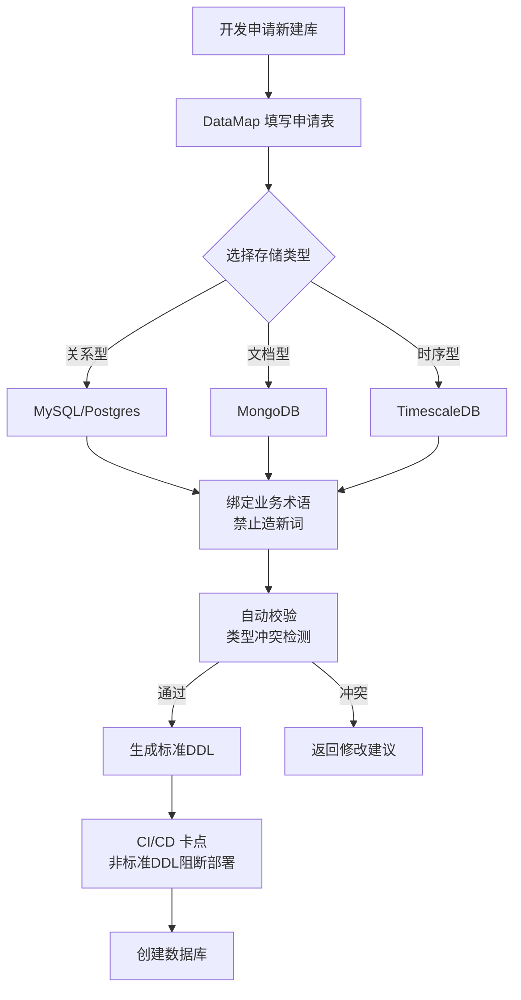

# DataMap-Lite 技术规格说明书：研发领域轻量级数据目录系统

**版本**：v1.0  
**技术栈**：Golang 1.26 + PostgreSQL 16 + Gin  
**目标用户**：半导体显示研发部门
**核心定位**：解决"同义不同名"（PanelID/plt_no/玻璃编号）的元数据治理，非数据中台，非 CMDB 替代

---

## 1. 架构决策与约束

### 1.1 边界定义（做什么与不做什么）

| 范围 | 包含 | 明确排除 |
|------|------|----------|
| **数据存储** | 只存**元数据**（表结构、字段、映射关系），不存业务数据 | 不迁移数据，不做 ETL |
| **系统对接** | 预留 CMDB 适配器接口（当前空实现 `NoOpAdapter`） | 不主动推送集团 CMDB（你们现在不需要） |
| **存储治理** | 支持 MySQL（精确 Schema）+ MongoDB（抽样推断）双轨 | 不强求存储统一，不强制迁移 |
| **流程卡点** | 新建系统必须通过 DataMap 审批生成 DDL | 不拦截存量系统（先污染后治理） |

### 1.2 技术选型理由

- **Golang**：你们团队技术栈，并发处理采集任务效率高
- **PostgreSQL**：元数据中枢，利用 `JSONB` 存 MongoDB 的动态字段路径，利用 `pg_trgm` 做模糊搜索
- **异构采集**：
  - MySQL：直接查 `information_schema`（确定性）
  - MongoDB：抽样 1000 条文档推断 Schema（概率性），人工校准置信度

---

## 2. 数据模型设计（PostgreSQL）

### 2.1 核心实体关系

```sql
-- 1. 数据源注册（支持多类型）
CREATE TABLE data_sources (
    id UUID PRIMARY KEY DEFAULT uuid_generate_v4(),
    code VARCHAR(50) UNIQUE NOT NULL,        -- 如：mes_mysql, defect_mongo
    name VARCHAR(100) NOT NULL,
    db_type VARCHAR(20) CHECK (db_type IN ('mysql', 'postgres', 'oracle', 'mongodb', 'mssql')),
    connection_config JSONB NOT NULL,        -- 加密存储：host, port, dbname, user, pwd
    is_active BOOLEAN DEFAULT true,
    last_sync_at TIMESTAMP,
    created_at TIMESTAMP DEFAULT CURRENT_TIMESTAMP
);

-- 2. 业务术语表（数据标准核心）
CREATE TABLE business_terms (
    id UUID PRIMARY KEY DEFAULT uuid_generate_v4(),
    term VARCHAR(100) UNIQUE NOT NULL,       -- 如：玻璃基板编号
    standard_code VARCHAR(50) UNIQUE NOT NULL, -- 如：PANEL_ID（全局唯一编码）
    domain VARCHAR(50),                      -- 如：生产制造
    definition TEXT,
    data_type_standard VARCHAR(50),          -- 建议类型：VARCHAR(20)
    validation_rule TEXT,                    -- 正则：^[A-Z]\d{5}$
    owner VARCHAR(100),
    status VARCHAR(20) DEFAULT 'active' CHECK (status IN ('draft', 'active', 'deprecated'))
);

-- 3. 物理对象（表/集合）
CREATE TABLE schema_objects (
    id UUID PRIMARY KEY DEFAULT uuid_generate_v4(),
    source_id UUID REFERENCES data_sources(id) ON DELETE CASCADE,
    object_type VARCHAR(20) CHECK (object_type IN ('table', 'view', 'collection')),
    schema_name VARCHAR(100),                -- MySQL 的 schema 或 MongoDB 的 database
    object_name VARCHAR(100) NOT NULL,       -- 表名或集合名
    estimated_rows BIGINT,
    extra_info JSONB,                        -- 存储索引、分片信息等
    updated_at TIMESTAMP DEFAULT CURRENT_TIMESTAMP,
    UNIQUE(source_id, schema_name, object_name)
);

-- 4. 字段元数据（核心表）
CREATE TABLE columns (
    id UUID PRIMARY KEY DEFAULT uuid_generate_v4(),
    object_id UUID REFERENCES schema_objects(id) ON DELETE CASCADE,
    column_name VARCHAR(100) NOT NULL,       -- MySQL 列名或 MongoDB 字段路径（如：metadata.panel.id）
    is_nested BOOLEAN DEFAULT false,         -- 是否为 MongoDB 嵌套字段
    parent_path VARCHAR(200),                -- MongoDB 父路径（如：metadata.panel）
    data_type VARCHAR(100),                  -- 原始类型
    nullable BOOLEAN,
    default_value TEXT,
    comment TEXT,
    sample_values JSONB,                     -- 抽样值（用于理解格式）
    business_term_id UUID REFERENCES business_terms(id),
    confidence FLOAT CHECK (confidence BETWEEN 0 AND 1), -- MongoDB 推断置信度
    updated_at TIMESTAMP DEFAULT CURRENT_TIMESTAMP,
    UNIQUE(object_id, column_name)
);

-- 5. 跨系统字段映射（解决 PanelID/plt_no 问题）
CREATE TABLE column_mappings (
    id UUID PRIMARY KEY DEFAULT uuid_generate_v4(),
    source_column_id UUID REFERENCES columns(id),
    target_column_id UUID REFERENCES columns(id),
    mapping_type VARCHAR(20) CHECK (mapping_type IN ('synonym', 'transform', 'derive')),
    transform_logic TEXT,                    -- 如：substr(panel_id, 2) 或 toUpperCase()
    confidence FLOAT DEFAULT 1.0,
    verified BOOLEAN DEFAULT false,          -- 人工确认后才生效
    created_by VARCHAR(100),
    created_at TIMESTAMP DEFAULT CURRENT_TIMESTAMP,
    CHECK (source_column_id != target_column_id)
);

-- 6. 数据血缘（表级/字段级）
CREATE TABLE lineage_edges (
    id UUID PRIMARY KEY DEFAULT uuid_generate_v4(),
    source_id UUID NOT NULL,                 -- 可能是 columns.id 或 schema_objects.id
    target_id UUID NOT NULL,
    edge_type VARCHAR(20) CHECK (edge_type IN ('etl', 'view', 'api', 'manual', 'sync')),
    job_name VARCHAR(100),                   -- ETL 任务名或代码仓库文件
    transform_logic TEXT,
    granularity VARCHAR(10) CHECK (granularity IN ('column', 'table')),
    created_at TIMESTAMP DEFAULT CURRENT_TIMESTAMP
);

-- 7. Schema 变更审计（用于影响分析）
CREATE TABLE schema_changes (
    id UUID PRIMARY KEY DEFAULT uuid_generate_v4(),
    source_id UUID REFERENCES data_sources(id),
    change_type VARCHAR(20) CHECK (change_type IN ('column_added', 'column_removed', 'type_changed', 'comment_updated')),
    object_name VARCHAR(100),
    column_name VARCHAR(100),
    old_value TEXT,
    new_value TEXT,
    detected_at TIMESTAMP DEFAULT CURRENT_TIMESTAMP,
    notified BOOLEAN DEFAULT false           -- 是否已通知下游（预留）
);

-- 索引优化
CREATE INDEX idx_columns_term ON columns(business_term_id);
CREATE INDEX idx_columns_name_trgm ON columns USING gin(column_name gin_trgm_ops);  -- 模糊搜索
CREATE INDEX idx_mappings_source ON column_mappings(source_column_id);
CREATE INDEX idx_lineage_source ON lineage_edges(source_id);
CREATE INDEX idx_objects_source ON schema_objects(source_id);
```

---

## 3. 核心功能模块设计

### 3.1 元数据采集引擎（Scanner）

**设计原则**：插件化，支持不同存储的差异化采集策略

```go
// 接口定义（internal/scanner/scanner.go）
type SchemaScanner interface {
    // 测试连接连通性
    TestConnection(ctx context.Context, ds DataSource) error
    // 采集 Schema（全量）
    ScanSchema(ctx context.Context, ds DataSource) (*SchemaResult, error)
    // 增量检测变更（用于定时巡检）
    DetectChanges(ctx context.Context, ds DataSource, lastSnapshot time.Time) ([]SchemaChange, error)
}

// SchemaResult 统一返回格式
type SchemaResult struct {
    Objects []ObjectMeta
    Columns []ColumnMeta
}

// 注册表（main.go 初始化时注册）
var ScannerRegistry = map[string]SchemaScanner{
    "mysql":    &MySQLScanner{},
    "postgres": &PostgreSQLScanner{},
    "mongodb":  &MongoDBScanner{},
    // 后续扩展：oracle, mssql, clickhouse...
}
```

**MySQL 实现要点**：
- 查询 `information_schema.tables` 和 `columns`
- 获取列的注释、约束（PK/FK）、索引信息
- **确定性采集**：信任数据库元数据，confidence = 1.0

**MongoDB 实现要点**：
- 使用 `$sample` 聚合管道抽样 1000 条文档
- 使用 `$objectToArray` 展开文档分析字段出现频率
- **概率性采集**：
  - 字段出现率 >90%：confidence = 0.9，标记为 `likely_schema`
  - 字段出现率 50-90%：confidence = 0.6，标记为 `sparse_field`
  - 需人工在 Web 界面确认（verified = true 后参与映射）

### 3.2 业务服务层（Service）

```go
// internal/service/metadata.go
type MetadataService struct {
    store     *store.Store
    scanners  map[string]scanner.SchemaScanner
    // CMDB 适配器（预留接口，当前注入 NoOpAdapter）
    cmdb      integration.CMDBAdapter
}

// 核心方法

// 1. 手动触发采集（管理员用）
func (s *MetadataService) SyncDataSource(ctx context.Context, sourceID uuid.UUID) error

// 2. 全局字段搜索（支持模糊匹配和同义词扩展）
// 搜索逻辑：输入 "panel" → 匹配 column_name + business_term + comment
// 如果命中 business_term，同时返回该术语下的所有物理字段（跨系统）
func (s *MetadataService) SearchColumns(ctx context.Context, keyword string, filters SearchFilters) ([]ColumnResult, error)

// 3. 影响分析（改字段前必查）
// 递归查询 lineage_edges 的下游节点，结合 column_mappings 的跨系统影响
func (s *MetadataService) AnalyzeImpact(ctx context.Context, columnID uuid.UUID) (*ImpactReport, error)

// 4. 新建系统审批（正向工程）
// 检查：存储选型合理性、术语复用、命名规范
func (s *MetadataService) ValidateNewSystem(ctx context.Context, req NewSystemRequest) (*ValidationResult, string, error) // 返回校验结果和建议 DDL
```

### 3.3 API 路由设计（RESTful）

```go
// internal/api/router.go
func (h *Handler) Register(r *gin.Engine) {
    v1 := r.Group("/api/v1")
    
    // 数据源管理
    sources := v1.Group("/sources")
    {
        sources.GET("", h.ListSources)
        sources.POST("", h.CreateSource)           // Body: connection_config (加密存储)
        sources.GET("/:id", h.GetSource)
        sources.POST("/:id/test", h.TestConnection) // 测试连接
        sources.POST("/:id/sync", h.TriggerSync)    // 手动触发采集
        sources.GET("/:id/schema", h.GetSchemaTree) // 树形：schema -> tables -> columns
        sources.GET("/:id/changes", h.GetChanges)   // 变更历史
    }
    
    // 字段治理（核心）
    v1.GET("/search", h.GlobalSearch)              // Query: q=panel_id&db_type=mysql,mongodb&fuzzy=true
    v1.GET("/columns/:id", h.GetColumnDetail)      // 包含：基础信息、业务术语、抽样值、映射关系
    v1.GET("/columns/:id/impact", h.GetImpactAnalysis) // 返回：下游血缘、跨系统映射、风险等级
    
    // 字段映射（人工治理）
    mappings := v1.Group("/mappings")
    {
        mappings.POST("", h.CreateMapping)         // 建立同义词关系
        mappings.GET("/conflicts", h.ListTypeConflicts) // 检测：同术语但类型不同（如 VARCHAR vs INT）
        mappings.POST("/:id/verify", h.VerifyMapping)   // 人工确认映射
    }
    
    // 血缘管理
    lineage := v1.Group("/lineage")
    {
        lineage.GET("/:id/tree", h.GetLineageTree) // Query: direction=upstream|downstream&depth=3
        lineage.POST("/edges", h.CreateLineageEdge) // 手动标注血缘（从 ETL 脚本提取）
        lineage.DELETE("/edges/:id", h.DeleteLineageEdge)
    }
    
    // 业务术语（数据标准）
    terms := v1.Group("/terms")
    {
        terms.GET("", h.ListTerms)
        terms.POST("", h.CreateTerm)               // 新建标准术语
        terms.PUT("/:id", h.UpdateTerm)
        terms.POST("/:id/bind", h.BindToColumn)    // 绑定字段到术语（治理动作）
        terms.GET("/:id/columns", h.GetTermColumns) // 查看该术语在哪些系统落地
    }
    
    // 正向工程（新建系统卡点）
    v1.POST("/system-design/validate", h.ValidateSystemDesign) // 提交设计预审
    v1.POST("/system-design/ddl", h.GenerateDDL)               // 生成标准 DDL
    
    // CMDB 预留接口（当前返回 501 Not Implemented 或配置状态）
    v1.GET("/integration/status", h.IntegrationStatus)
}
```

### 3.4 存储插件化设计（供后续扩展）

```go
// internal/integration/storage/plugin.go
type StoragePlugin interface {
    // 元数据层面
    ScanSchema(ctx context.Context, conn ConnectionConfig) (SchemaSnapshot, error)
    ValidateField(ctx context.Context, field BusinessTerm, physical PhysicalField) error
    
    // DDL 生成（正向工程）
    GenerateCreateTableDDL(tableName string, fields []BusinessTerm) (string, error)
    GenerateValidationSchema(collectionName string, fields []BusinessTerm) (map[string]interface{}, error) // MongoDB JSON Schema
}

// 工厂方法
func GetStoragePlugin(dbType string) (StoragePlugin, error) {
    switch dbType {
    case "mysql":
        return &MySQLPlugin{}, nil
    case "mongodb":
        return &MongoDBPlugin{}, nil
    case "timescaledb":
        return &TimescaleDBPlugin{}, nil // 后续实现
    default:
        return nil, fmt.Errorf("unsupported db type: %s", dbType)
    }
}
```

---

## 4. 治理策略实施路径

### 4.1 存量系统（逆向工程 - 先污染后治理）

**目标**：理清楚现有 MySQL + MongoDB 的字段对应关系，不迁移数据。

**实施步骤**：
1. **批量采集**：对现有 4-5 个系统执行全量 Schema 扫描（MySQL 精确采集，MongoDB 抽样）
2. **智能推荐**：基于字段名相似度（Levenshtein 距离）+ 抽样值重叠度，自动推荐映射关系（如 `panel_id` ↔ `plt_no`）
3. **人工确认**：业务专家在 Web 界面确认推荐映射，标记 `verified = true`
4. **补标术语**：为高频字段绑定业务术语（如所有系统的 PanelID 都指向术语"玻璃基板编号"）

**产出物**：
- 《字段对标清单》：输入"玻璃编号"，知道在 MES 查 `panel_id`，在测试系统查 `lots.plt_no`
- 《影响分析图谱》：修改 MES 的 `panel_id` 长度，自动列出受影响的 3 个下游报表

### 4.2 增量系统（正向工程 - 先标准后建表）

**目标**：新系统（如 AI 缺陷分类、量化回测平台）必须符合数据标准，防止新增混乱。

**强制卡点流程**：


**关键约束**：
- **术语强制复用**：如果标准术语表已有"玻璃基板编号"，禁止新建字段叫 `glass_id` 或 `pid`
- **类型一致性**：术语要求 `VARCHAR(20)`，提交的 DDL 如果是 `TEXT`，阻断并提示
- **存储选型合理性**：在申请表单里声明事务需求，如果选择 MongoDB 但有复杂多表事务，系统警告建议改用 MySQL

---

## 5. MVP 功能清单

### Phase 1：元数据基座（Week 1-2）
- [ ] **数据源管理**：CRUD + 加密存储连接串 + 连通性测试
- [ ] **MySQL 采集器**：完整实现 `information_schema` 查询，支持增量变更检测
- [ ] **MongoDB 采集器**：抽样推断 + 嵌套字段路径处理（如 `metadata.panel.id`）
- [ ] **Schema 浏览器**：树形展示（Source → Database → Table/Collection → Column）

### Phase 2：治理核心（Week 3）
- [ ] **全局搜索**：支持 `pg_trgm` 模糊搜索，结果区分存储类型（图标区分 MySQL/MongoDB）
- [ ] **字段映射**：手动创建映射关系 API + 自动推荐（基于名称相似度）
- [ ] **影响分析**：递归 CTE 查询下游血缘，生成风险报告（High/Medium/Low）
- [ ] **变更审计**：定时巡检检测 Schema 变更（新增字段/类型修改），记录到 `schema_changes`

### Phase 3：正向工程（Week 4）
- [ ] **术语管理**：术语 CRUD + 与字段绑定
- [ ] **DDL 生成器**：
  - MySQL：标准 `CREATE TABLE`（带注释、外键）
  - MongoDB：生成 `createCollection` with JSON Schema validation
- [ ] **预审 API**：`POST /system-design/validate` 实现存储选型检查和术语冲突检测

### Phase 4：集成与优化（Week 5）
- [ ] **Web 前端**（React）：Schema 浏览器、搜索页、血缘图谱（ECharts 力导向图）
- [ ] **CI/CD 示例**：GitLab CI 脚本模板，展示如何调用 DataMap API 卡点
- [ ] **CMDB 接口预留**：实现 `NoOpAdapter`，预留 HTTP 接口供未来扩展

---

## 6. 命名规范与约定

### 6.1 数据库命名
- **表名**：复数形式，下划线分隔，如 `schema_objects`, `column_mappings`
- **JSONB 字段**：使用下划线，如 `extra_config`, `sample_values`
- **枚举值**：小写 + 下划线，如 `'synonym'`, `'type_changed'`

### 6.2 Go 代码规范
- **包结构**：按功能分层（`api`, `service`, `store`, `scanner`, `integration`）
- **接口命名**：`XxxScanner`, `XxxService`, `XxxAdapter`
- **错误处理**：Wrap 错误并添加上下文，`fmt.Errorf("scan mysql schema failed: %w", err)`

### 6.3 API 规范
- **路由**：RESTful，资源复数，如 `/api/v1/sources`, `/api/v1/columns`
- **响应格式**：
  ```json
  {
    "data": {...},
    "error": null,
    "pagination": {"total": 100, "page": 1}
  }
  ```
- **搜索参数**：`q`（关键词）, `db_type`（过滤）, `fuzzy`（布尔，是否模糊匹配）

---

## 7. 风险与注意事项

1. **密码安全**：数据库连接密码必须使用 AES 加密存储，解密只在 Scanner 运行时内存中进行
2. **MongoDB 抽样偏差**：如果集合有 1000 个分片，抽样可能遗漏稀疏字段，需允许人工补录字段
3. **循环血缘**：`lineage_edges` 可能出现 A→B→C→A，递归查询需限制深度（默认 10 层）或检测循环
4. **CMDB 解耦**：当前所有 CMDB 相关代码必须可通过配置开关完全禁用，不能影响核心功能